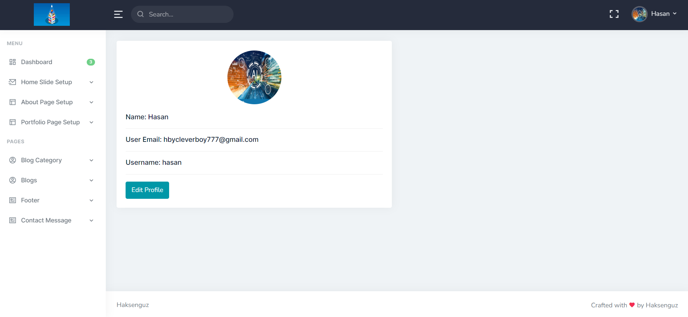
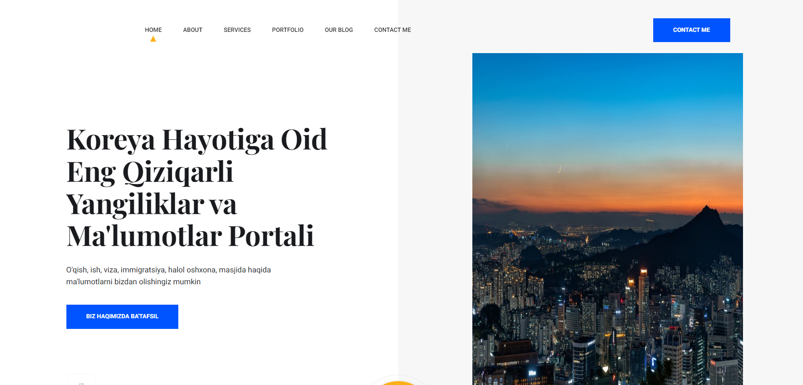

# Haksenguz Blog

Haksenguz is a blog website which is to publish news, frequently asked locations, useful information, blogs, and promote services.   Website contains sections such as home, about, services, portfolio, blog, contact. Visitors can contact admin using contact me section. Haksenguz consist of **admin dashboard**

 and  **front-end** page. 

Admin can:
 - insert,
- edit ,
 - update,
- delete,
 data which will be shown on **font-end** page. 
---
**Dashboard** - can be logged in through *login*. 
**Register** - user can register for dashboard. 
**Login** - robust login system with __Laravel Breeze__. 
**Forgot password** - in case of password is lost or forgotten, user can restore password through *email verification*.   

