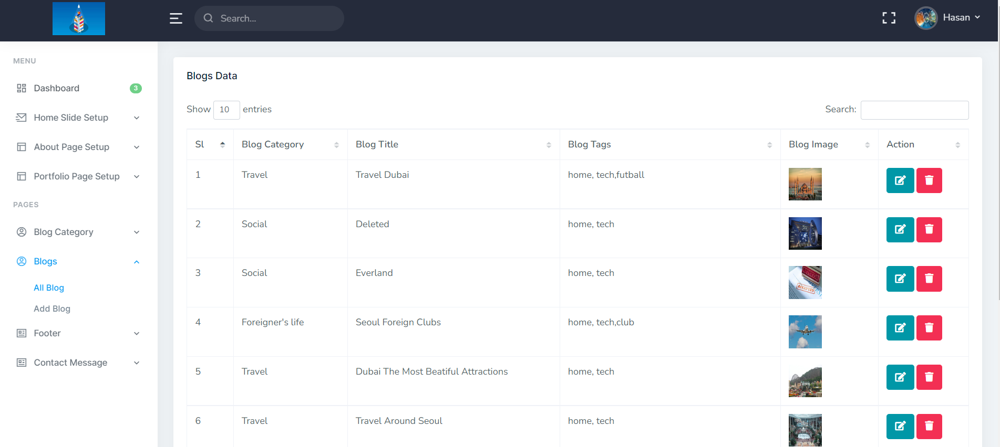
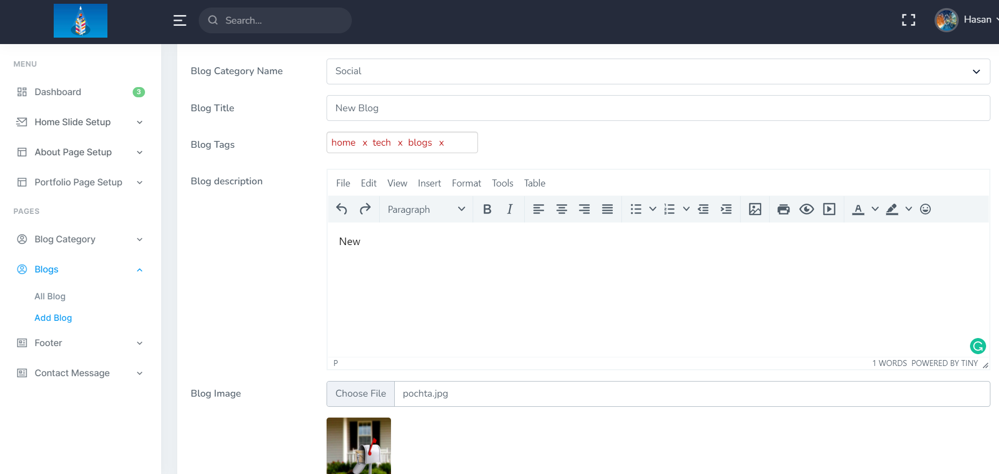

# Haksenguz Blog

Haksenguz is a blog website which is to publish news, frequently asked locations, useful information, blogs, and promote services. <br/> Website contains sections such as home, about, services, portfolio, blog, contact. Visitors can contact admin using contact me section. Haksenguz consist of **admin dashboard**


 and  **front-end** page. 


Admin can:
 - insert,
- edit ,
 - update,
- delete,
 data which will be shown on **font-end** page.<br/>
---
**Dashboard** - can be logged in through *login*.<br/>
**Register** - user can register for dashboard.<br/>
**Login** - robust login system with __Laravel Breeze__.<br/>
**Forgot password** - in case of password is lost or forgotten, user can restore password through *email verification*. <br/><br/>
Admin can edit, delete all data,<br>
<br/>

add new blogs,
<br/><br/>

---

##Pre-requisite
-[Composer](https://getcomposer.org/download/)<br/>
-[Laravel 9](https://laravel.com/docs/9.x/starter-kits)<br/>
-[Intervention Image](https://image.intervention.io/v2)<br/><br/>

---
###Installation<br/>
1. Composer installation using command line.<br/>
```
php -r "copy('https://getcomposer.org/installer', 'composer-setup.php');"
php -r "if (hash_file('sha384', 'composer-setup.php') === '55ce33d7678c5a611085589f1f3ddf8b3c52d662cd01d4ba75c0ee0459970c2200a51f492d557530c71c15d8dba01eae') { echo 'Installer verified'; } else { echo 'Installer corrupt'; unlink('composer-setup.php'); } echo PHP_EOL;"
php composer-setup.php
php -r "unlink('composer-setup.php');"
```
